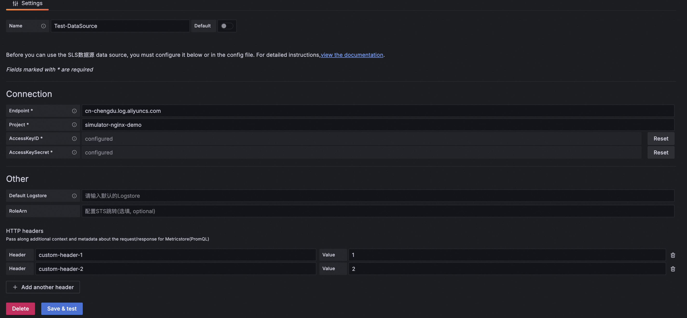

# Changelog

# 2.35 (2024-10-21)

优化查询分析接口性能。

# 2.34 (2024-09-23)

- 优化 table/log 视图
  - 支持当存在纳秒字段时, time 按纳秒精度排序。
  - 支持修改总查询记录数 totalLogs, 默认值为 100, 最小值为 1, 最大值为 5000, 仅对 Query 查询语句生效, 分析语句无效
    
- 修复 gotoSLS 仅可跳转至数据源中设置的默认 Logstore 的问题
- 修复 gotoSLS 跳转后变量替换为具体值的问题

# 2.33 (2024-09-01)

- 插件配置界面优化,必填项为 `Endpoint Project AccessKeyID AccessKeySecret`, 不再强制要求填写 `LogStore`;如果不填写 `LogStore`, 请确保你的填写的 Ak 具备当前 Project 的 ListProject 权限，参考 [ListLogStores - 列出 LogStore](https://help.aliyun.com/zh/sls/developer-reference/api-sls-2020-12-30-listlogstores)
- 插件支持自定义 Headers, 但仅在数据源类型为`MetricStore(PrmQL)` 生效
  
- 插件编辑界面优化,支持切换数据源类型和在编辑界面下拉选择具体[日志库(Logstore)](https://help.aliyun.com/zh/sls/product-overview/logstore)或[时序库(MetricStore)](https://help.aliyun.com/zh/sls/product-overview/metricstore?spm=a2c4g.11186623.0.0.2e8b60d1YQznSr)
  

  - 数据源类型主要是两种语法区别`SQL` 和 `PromQL`,再加上存储库的类型不同，有四种类型可选: `ALL(SQL)`、`Logstore(SQL)`、`MetricStore(SQL)`、`MetricStore(PromQL)` ;
  - 日志库(Logstore)支持`SQL`[日志库(Logstore)查询分析](https://help.aliyun.com/zh/sls/user-guide/search-and-analysis);
  - 时序库(MetricStore)支持`SQL + PromQL`[时序库(MetricStore)查询分析](https://help.aliyun.com/zh/sls/user-guide/search-and-analysis);
  - `MetricStore(PromQL)`支持添加 `custom Headers`,具体在该数据源的配置界面进行添加；

# 2.32 (2023-04-16)

- 支持时序图断点展示，通过 time_series(`时间列`, `补全窗口`, `%Y-%m-%d %H:%i:%s`, `null`) 补 null 值进行断点展示
  - time*series 参考：[time_series 时间补全函数说明](https://help.aliyun.com/zh/sls/user-guide/date-and-time-functions-1?spm=a2c4g.11186623.0.i10#section-wsz-wt2-4fb)
    

# 2.31 (2023-10-18)

- 支持日志图在 Grafana v10 的展示，日志图可以指定想展示的字段，ycol 格式为`字段1,字段2`
- 流图支持多条线，ycol 格式为`#:#指标1,指标2`
- 修改表格区域的名字为 ycol，使多个表格在同一个图表时，可以区分。

- Supports the display of log graphs in Grafana v10. Log graphs can specify the fields you want to display. The ycol format is `Field 1, Field 2`
- The flow graph supports multiple lines, and the ycol format is `#:#Indicator 1,Indicator 2`
- Modify the name of the table area to ycol so that multiple tables can be distinguished when they are in the same chart.

# 2.30 (2023-07-25)

- 优化 SLS Grafana 插件后端结构，现支持加入自定义 Resource API 功能。
- 引入 gotoSLS 功能，用户可以方便地跳转到 SLS 控制台进行查询，和体验 SLS 控制台更强大的功能，跳转附带当前 Grafana 的 query、时间信息。在 DataSource 界面配置 roleArn 可实现 STS 跳转，若不配置，则按照正常直接访问逻辑跳转（需要登录控制台）。
  - **注意：若配置 STS 跳转，为权限安全考虑，需要满足以下两个条件**：
    - **配置 DataSource 的 accessKey 对应的用户，需要有**`**AliyunRAMReadOnlyAccess**`**权限**
    - **配置 DataSource 的 roleArn，里面的权限策略，必须有且只有**`**AliyunLogReadOnlyAccess**`
  - 原理参考：[控制台内嵌及分享](https://help.aliyun.com/document_detail/74971.html)
- 优化`xcol`的表现形式，现以下拉框的形式规范推荐输入。兼顾兼容性与自定义输入。
- Variable 编辑页面，SLS DataSource 同样引入 Monaco Editor，且自动识别 grafana 版本切换新老显示。
- 修复`xcol`与`ycol`输入框末尾 Tips 在 Grafana 8.3.x 及以下无法显示的问题。
- 修复部分适配问题。

 

- Optimize the back-end structure of the SLS Grafana plug-in, and now support the addition of custom Resource API functions.
- Introducing the gotoSLS function, users can easily jump to the SLS console to query and experience more powerful functions of the SLS console, and the jump includes the current Grafana query and time information. Configuring roleArn on the DataSource interface can realize STS jumping. If not configured, it will jump according to the normal direct access logic (login to the console is required).
  - **Note: If STS redirection is configured, the following two conditions need to be met for permission security considerations:**
    - **To configure the user corresponding to the accessKey of the DataSource, `AliyunRAMReadOnlyAccess` permission is required**
    - **Configure the roleArn of DataSource, the permission policy inside must have and only `AliyunLogReadOnlyAccess`**
  - Principle reference: [Console embedding and sharing](https://help.aliyun.com/document_detail/74971.html)
- Optimize the expression form of `xcol`, and now standardize the recommended input in the form of a drop-down box. Take into account compatibility and custom input.
- On the Variable editing page, SLS DataSource also introduces Monaco Editor, and automatically recognizes the grafana version to switch between the new and old displays.
- Fix the problem that Tips at the end of the `xcol` and `ycol` input boxes cannot be displayed in Grafana 8.3.x and below.
- Fix some adaptation problems.

# 2.29 (2023-06-29)

- 全新 SLS Query 编写体验，引入 Monaco Editor，支持语法高亮显示，关键字、函数自动提示等功能。
- SLS Query 框支持多行自动换行和高度扩展。
- `xcol`与`ycol`的输入使用 Grafana 的 Input 组件，带来更一致的体验。
- `xcol`与`ycol`输入框末尾增加 Tips，介绍常见写法，方便初学者上手。
- 修复一系列版本问题。

 

- Brand-new SLS Query writing experience, introduces Monaco Editor, supports syntax highlighting, keyword, function automatic prompting and other functions.
- The SLS Query box supports multi-line word wrapping and height expansion.
- The input of xcol and ycol uses Grafana's Input component to bring a more consistent experience.
- Tips are added at the end of the xcol and ycol input boxes to introduce common writing methods, which is convenient for beginners.
- Fix a series of version issues.

 

# 2.28

- 适配 Grafana 9.4 及以上版本的 Datasource 数据源结构。
   
- Adapt to the Datasource data source structure of Grafana 9.4 and above.

# 2.27

- 加了 legacy_compatible 设置，适配旧版本的返回结构（带 response）
   
- Added legacy_compatible to adapt to the return structure of the old version (with response)

# 2.0.0 (released)

Initial release.

Support Grafana 8.0.
